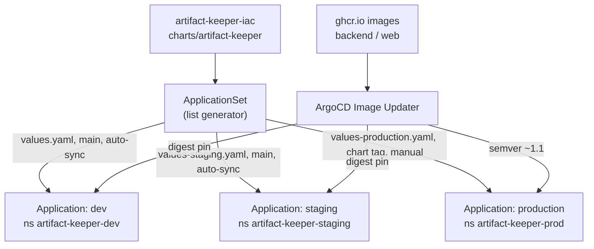

# Architecture

This repository holds the infrastructure for Artifact Keeper: the Helm chart
that runs the application on Kubernetes, the Terraform that provisions the AWS
platform underneath it, the ArgoCD manifests that drive delivery, and the CI
runner and maintenance plumbing that supports the build pipeline. The
application code lives in separate repositories (`artifact-keeper`,
`artifact-keeper-web`, and so on); this repo only deploys the published
container images.

This document is for maintainers of the infra itself. It explains how the
pieces fit together and which file you edit for a given change. For the
release mechanics of the chart, see `RELEASING.md`. For consumer-facing
install instructions, see `README.md`.

## Repo map

| Directory | Deploys / defines | You touch it when |
|-----------|-------------------|-------------------|
| `charts/artifact-keeper/` | The umbrella Helm chart for the whole application (backend, web, edge, Postgres, OpenSearch, Trivy, scanner-adapter, DependencyTrack, ingress, secrets, policies). | Changing what runs in a cluster, adding a service, adjusting per-environment values. |
| `terraform/modules/` | Reusable AWS building blocks: `vpc`, `eks`, `rds`, `s3`. | Changing how a class of AWS resource is built for every environment. |
| `terraform/environments/` | One root module per environment (`dev`, `staging`, `production`) composing the four modules with environment-specific sizing. | Adding or resizing an environment's AWS footprint. |
| `argocd/` | GitOps delivery: the `ApplicationSet`, `AppProject`, image updater config, ARC runner scale-set values, and the registry-cache / namespace-sweeper / mesh Applications. | Changing how ArgoCD syncs environments or how CI runners are shaped. |
| `monitoring/` | `kube-prometheus-stack` values, a `PrometheusRule` with app alerts, and a Grafana dashboard JSON. | Changing alerting or dashboards. |
| `e2e/` | In-cluster manifests for end-to-end and mesh tests (dind registry-mirror ConfigMap, mesh Job + RBAC, registry-cache static PVs, runner RBAC). | Changing the in-cluster test harness. |
| `runner-images/` | Dockerfiles for the ARC runner images (`rust`, `e2e`). | Bumping runner toolchains. |
| `ci-maintenance/` | The CI namespace-sweeper CronJob and its scoped RBAC. | Changing the leaked-namespace reclaim policy. |
| `aws-scripts/` | Single-node EC2 deployment: Docker install, a `docker-compose.yml`, an Nginx host config, and a first-boot secret-generation script. | Changing the all-in-one VM install path. |
| `packer/` | A Packer template that bakes the single-node compose stack into an AMI. | Cutting a new prebuilt AMI. |
| `demo/` | The `demo.artifactkeeper.com` compose file, reset script, and seed SQL. | Changing the public demo. |
| `.github/` | Workflows (`helm-ci`, `helm-release`, `helm-docs`, `ci`, `runner-images`, `require-linked-issue`), the PR template, CODEOWNERS, Dependabot. | Changing CI or contribution rules. |

There is no top-level git repo across the workspace; this directory is its own
repository.

## Helm chart anatomy

The chart is a single application chart (`type: application`, no subcharts).
Every service is a first-class template in `templates/` guarded by an
`<service>.enabled` flag, rather than a bundled dependency. That keeps all
services versioned and rendered together and lets any one of them be turned
off per environment.

### Values layering

Values resolve in three layers, lowest precedence first:

1. `values.yaml` is the development profile. Everything is enabled, all
   dependencies run in-cluster (Postgres, OpenSearch, Trivy, DependencyTrack),
   and backend/web/edge track the floating `dev` image tag. It is heavily
   commented and doubles as the reference for every tunable.
2. Environment overlays layer on top: `values-staging.yaml`,
   `values-production.yaml`, `values-smoke.yaml`, `values-mesh-main.yaml` /
   `values-mesh-peer.yaml`, and `values-registry-cache.yaml`. Each only sets
   what differs from the base.
3. Deploy-time `--set` flags or ArgoCD Helm `parameters` win last. The mesh
   ApplicationSet, for example, injects `fullnameOverride` and peer identity
   this way.

### Service toggles and scheduling

Each component has an `enabled` flag and its own `image`, `resources`,
`podSecurityContext`, `containerSecurityContext`, and scheduling block. There
is a `global` scheduling block (`tolerations`, `affinity`, `nodeSelector`,
`topologySpreadConstraints`) applied to every workload. Per-component
scheduling fully replaces the global value for that component, it does not
merge. Setting `backend.tolerations` means the backend gets only those
tolerations, not global plus backend.

Image tags follow one rule worth memorizing: when `image.tag` is empty (`""`)
the template falls back to `.Chart.AppVersion`, so a tagged chart release is
reproducible. The dev/staging profiles keep an explicit `dev` floating tag;
production pins an explicit release; `scannerAdapter` pins its independent
major tag `"1"`; and `edge` stays pinned to `dev` everywhere because no edge
image is published at the chart's `appVersion` yet (issue #56).

Backend security context is load-bearing: the pod must run as UID 1001 because
the image bakes the Grype vulnerability DB owned by `1001:0`, and `fsGroup` is
`0`. Changing `runAsUser` breaks scans; changing `fsGroup` triggers a
recursive re-chown of the storage PVCs on next mount.

### Adding a new service or sidecar

For a new backend service or standalone component:

1. Add a values block with `enabled`, `image`, `resources`, security contexts,
   and the per-component scheduling keys.
2. Add a `selectorLabels` helper for it in `templates/_helpers.tpl` following
   the existing per-component pattern.
3. Add `deployment` and `service` templates under `templates/`, each wrapped
   in `{{- if .Values.<service>.enabled }}`.
4. Wire non-secret env through `templates/configmap.yaml` and secret env
   through `templates/secrets.yaml` (and the External Secrets path, below).
5. If it introduces a new Kubernetes resource kind, add that kind to the
   `AppProject` `namespaceResourceWhitelist` in `argocd/appproject.yaml`, or
   ArgoCD will refuse to create it.
6. If it cannot run in a minimal smoke namespace, add it to the disabled
   section of `values-smoke.yaml` with a comment explaining why. That file is
   the single source of truth for what smoke turns off.

A sidecar on an existing pod is simpler: add it to that component's deployment
template and gate it on a sub-flag under the component's values.

### Secrets: native vs External Secrets

Both paths converge on one Kubernetes Secret named `<fullname>-secrets`, which
the backend consumes via `secretKeyRef`. The chart picks a path from
`externalSecrets.enabled`:

- Native (`externalSecrets.enabled: false`, the default): `templates/secrets.yaml`
  renders the Secret from `values.secrets.*` and inline auth values. The
  `validateSecrets` helper fails the render if `secrets.jwtSecret` or the
  Postgres password are empty, so a misconfigured install fails at
  `helm template` rather than at runtime.
- External Secrets (`externalSecrets.enabled: true`): `templates/external-secrets.yaml`
  renders `ExternalSecret` CRDs that sync from AWS Secrets Manager at paths
  like `artifact-keeper/<env>/jwt-secret`. This requires the External Secrets
  Operator and a `ClusterSecretStore` on the cluster. `values-production.yaml`
  uses this path and reads the RDS password from the secret the Terraform RDS
  module already writes.

## Terraform

### Module composition

Four modules (`vpc`, `eks`, `rds`, `s3`) are the building blocks. Each
environment root module (`terraform/environments/<env>/main.tf`) instantiates
all four and wires them together: the VPC's private subnets feed EKS and RDS,
the EKS cluster security group is granted RDS ingress, and module outputs
(cluster endpoint, OIDC provider ARN, RDS endpoint, DB password secret ARN, S3
bucket name) are re-exported for the chart and for IRSA wiring. Sizing is the
main thing that differs per environment:

- `dev`: single NAT gateway, public EKS endpoint, one `t3.large` node group,
  `db.t3.medium` single-AZ RDS, `force_destroy` S3.
- `production`: one NAT per AZ, private-only EKS endpoint, `general` plus
  `compute` node groups with autoscaling, `db.r6g.large` multi-AZ RDS with
  deletion protection and 14-day backups, versioned non-destroyable S3 with
  optional cross-region replication.

### State layout

Every environment uses the same S3 backend bucket and DynamoDB lock table,
separated by state key:

- Bucket: `artifact-keeper-terraform-state`
- Key: `<env>/terraform.tfstate`
- Lock table: `artifact-keeper-terraform-locks`
- Region: `us-east-1`, `encrypt = true`

See each `environments/<env>/backend.tf`. The bucket and table themselves are
bootstrap resources assumed to already exist.

### CIDR plan

Each environment gets a distinct `/16` so VPCs can peer without overlap:

| Environment | VPC CIDR |
|-------------|----------|
| dev | `10.0.0.0/16` |
| staging | `10.1.0.0/16` |
| production | `10.2.0.0/16` |

The VPC module carves three public and three private subnets across three AZs
using `cidrsubnet(vpc_cidr, 4, i)` for public (indices 0-2) and
`cidrsubnet(vpc_cidr, 4, i+3)` for private (indices 3-5), giving six `/20`
subnets. Public subnets carry the ELB tag, private subnets the internal-ELB
tag, and NAT gateways are one-per-AZ in production, one shared in dev/staging.
VPC flow logs to CloudWatch are on by default.

## GitOps flow

ArgoCD delivers the chart. The `AppProject` (`argocd/appproject.yaml`) scopes
which source repos and destination namespaces are allowed and whitelists the
resource kinds the chart emits. The `ApplicationSet`
(`argocd/applicationset.yaml`) uses a list generator with one element per
environment and renders one `Application` each, all pointing at
`charts/artifact-keeper` with the environment's values file.

Sync policy is deliberately not uniform:

| Env | targetRevision | Values file | Auto-sync | Image strategy |
|-----|----------------|-------------|-----------|----------------|
| dev | `main` | `values.yaml` | yes (selfHeal + prune) | digest |
| staging | `main` | `values-staging.yaml` | yes (selfHeal + prune) | digest |
| production | a chart tag (e.g. `v1.1.9`) | `values-production.yaml` | no (manual) | semver `~1.1` |

Promoting production is a deliberate act: bump the production element's
`targetRevision` to the new chart tag and sync by hand. Dev and staging
reconcile continuously from `main`.

ArgoCD Image Updater keeps the floating environments current without a commit
per build. Its controller values are in `argocd/image-updater-values.yaml`
(ghcr registry credentials, write-back method `argocd`), and the `ImageUpdater`
CR (`argocd/image-updater-cr.yaml`) watches every Application matching
`artifact-keeper-*` and `ak-*`, reading per-Application annotations for the
image list and update strategy. Dev and staging resolve the `dev` tag to a
concrete digest so rollouts are deterministic; production moves only within
the `~1.1` semver range.

Two Applications live outside the main set: `registry-cache` (manual sync,
pinned to a stable release, never auto-updated) and `ci-ns-sweeper` (auto-sync,
sourced from `ci-maintenance/`). A separate mesh ApplicationSet
(`argocd/mesh-test-applicationset.yaml`) stands up four peer namespaces for
replication testing, injecting per-instance identity via Helm parameters.

## CI and runners

CI runs on self-hosted Actions Runner Controller (ARC) v2 runner scale sets on
a dedicated runner cluster. Three pools exist, each configured by a values
file under `argocd/`:

- `ak-ci-runners` (`arc-ci-runners-values.yaml`): the default pool for lint,
  unit tests, and chart CI. Uses the `ak-runner-rust` image with a hostPath
  `/cache` for shared cargo/sccache/npm caches. Max runners are capped (6) to
  keep the per-runner memory limit from exhausting the node.
- `ak-beefy-runners` (`arc-beefy-runners-values.yaml`): heavier jobs.
- `ak-e2e-runners` (`arc-e2e-runners-values.yaml`): a Docker-in-Docker pool for
  compose-based E2E stacks, using the `ak-runner-e2e` image with explicit
  parallelism caps so cargo/nextest respect the pod's CPU limit instead of the
  host core count.

The scale-set chart is pinned to version `0.13.1` to match the ARC controller
already on the cluster; newer chart minors render a CR the running controller
silently drops. Both DinD pools route `docker.io` pulls through the in-cluster
registry-cache via the `dind-registry-mirror` ConfigMap
(`e2e/dind-registry-mirror-configmap.yaml`) and authenticate with a
`dockerhub-pull` secret to lift anonymous rate limits.

Runner images are built from `runner-images/{rust,e2e}/Dockerfile` and
published by `.github/workflows/runner-images.yml` on merge to `main`. Base
images and toolchains are pinned so the environment changes only through
reviewed bumps.

The namespace sweeper (`ci-maintenance/namespace-sweeper.yaml`) is a backstop
for leaked CI test namespaces. It is an hourly CronJob that deletes namespaces
matching an approved prefix (`smoke-self-`, `test-self-`) older than four
hours, guarded by a protected-substring denylist. The blast radius is
constrained in the script, not by RBAC, because namespace verbs cannot be
name-scoped. It ships as the `ci-ns-sweeper` ArgoCD Application with self-heal
on.

## Key invariants

- **Chart version discipline.** `version` and `appVersion` in `Chart.yaml`
  move together for application releases. The `helm-release` workflow keys off
  the chart `version` and tags `artifact-keeper-<version>`; the `helm-ci`
  workflow's image-reference gate blocks the merge if any rendered image tag
  404s on its registry. Publish images first, then bump the chart. See
  `RELEASING.md`.
- **Empty tag inherits appVersion.** Leave `image.tag` empty only when a
  component should track the chart's `appVersion`. Floating or independently
  versioned components (`dev`, `scanner-adapter: "1"`, `edge: dev`) must set an
  explicit tag.
- **Production assumes external managed services.** `values-production.yaml`
  sets `postgres.enabled: false` and points `externalDatabase` at the RDS
  secret; it enables External Secrets from AWS Secrets Manager, a three-node
  OpenSearch StatefulSet, and cert-manager TLS. The in-cluster Postgres and
  inline secrets are for dev and test only.
- **Production sync is manual.** Only dev and staging auto-sync. Production
  promotion is a `targetRevision` bump plus a hand-triggered sync.
- **Per-component scheduling replaces global.** It does not merge; there is no
  way to opt a single component out of global scheduling without restating it.
- **The registry-cache and mesh instances have independent lifecycles.** Never
  point the registry cache at `dev` or `latest`, and never enable image-updater
  on it; a broken cache breaks every CI pull.
