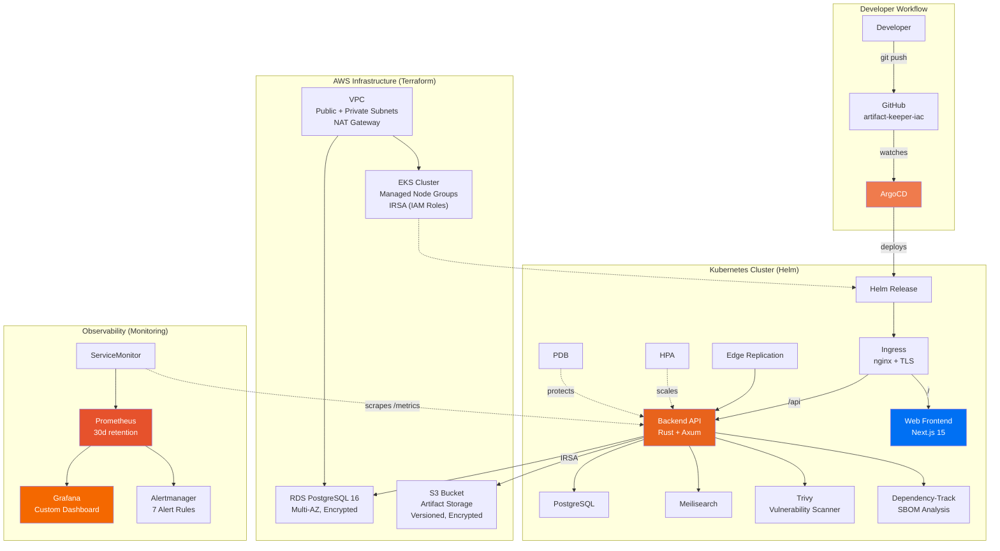
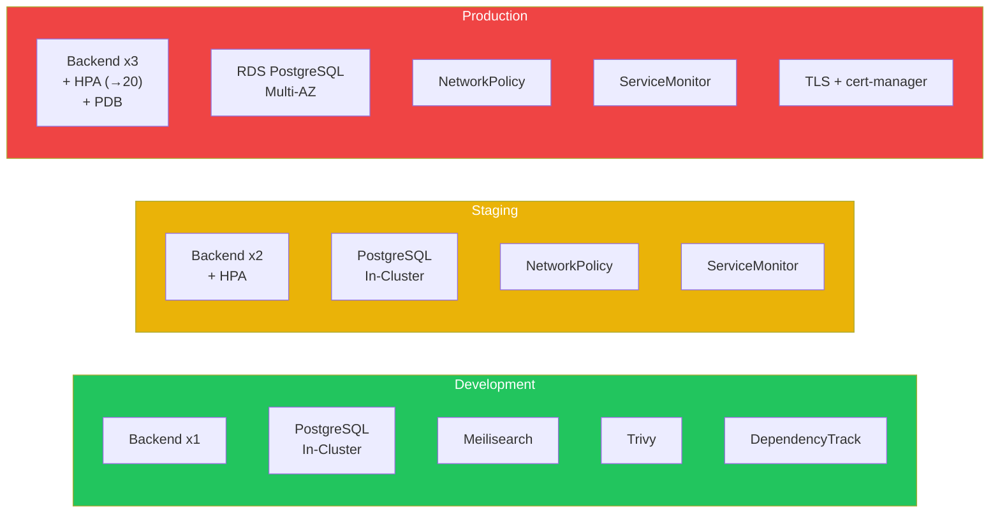
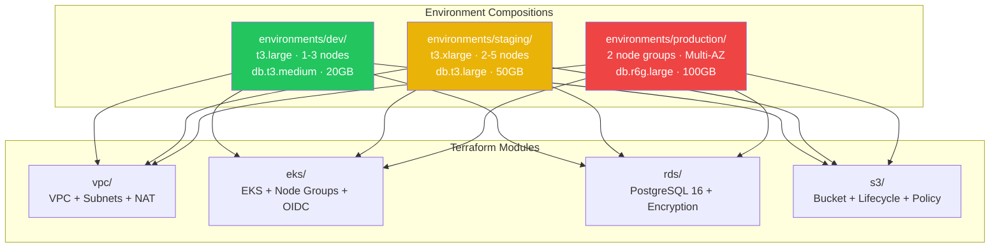
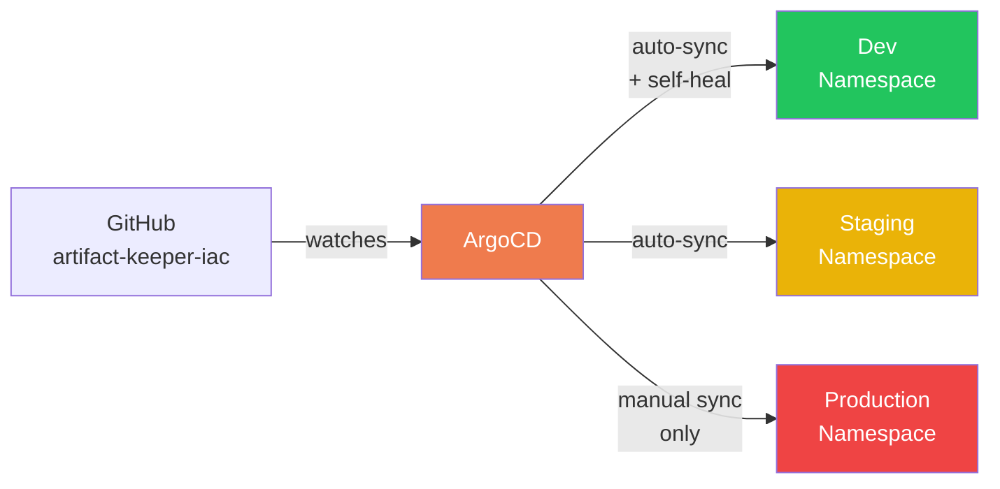

# Artifact Keeper IaC

Infrastructure as Code for [Artifact Keeper](https://github.com/artifact-keeper/artifact-keeper) — production-grade Helm charts, Terraform modules, ArgoCD GitOps, and monitoring stack.

> **Note:** All files in this repository are **example configurations** provided as getting-started templates. Review and modify them to match your specific infrastructure requirements, security policies, and operational needs before use in production.

## Architecture Overview



## Repository Structure

```
artifact-keeper-iac/
├── helm/                          # Helm Chart
│   ├── Chart.yaml
│   ├── values.yaml                # Development defaults
│   ├── values-staging.yaml        # Staging overlay
│   ├── values-production.yaml     # Production overlay
│   └── templates/
│       ├── backend-deployment.yaml
│       ├── backend-service.yaml
│       ├── backend-hpa.yaml       # HorizontalPodAutoscaler
│       ├── backend-pdb.yaml       # PodDisruptionBudget
│       ├── backend-serviceaccount.yaml
│       ├── backend-pvc.yaml
│       ├── web-deployment.yaml
│       ├── web-service.yaml
│       ├── edge-deployment.yaml
│       ├── edge-service.yaml
│       ├── postgres-statefulset.yaml
│       ├── meilisearch-deployment.yaml
│       ├── trivy-deployment.yaml
│       ├── dtrack-deployment.yaml
│       ├── ingress.yaml
│       ├── configmap.yaml
│       ├── secrets.yaml
│       ├── networkpolicy.yaml
│       └── servicemonitor.yaml
│
├── terraform/                     # Terraform Modules
│   ├── modules/
│   │   ├── vpc/                   # VPC, subnets, NAT, routing
│   │   ├── eks/                   # EKS cluster, node groups, IRSA
│   │   ├── rds/                   # RDS PostgreSQL, security groups
│   │   └── s3/                    # S3 bucket, encryption, lifecycle
│   └── environments/
│       ├── dev/                   # t3.large, 1-3 nodes, 20GB RDS
│       ├── staging/               # t3.xlarge, 2-5 nodes, 50GB RDS
│       └── production/            # Multi-AZ, 2 node groups, 100GB RDS
│
├── argocd/                        # ArgoCD GitOps
│   ├── appproject.yaml            # Project with RBAC roles
│   ├── applicationset.yaml        # Multi-env generator
│   └── argocd-values.yaml         # ArgoCD install config
│
└── monitoring/                    # Observability Stack
    ├── kube-prometheus-values.yaml # Prometheus + Grafana config
    ├── grafana-dashboard.json      # 12-panel custom dashboard
    └── alerting-rules.yaml         # 7 PrometheusRule alerts
```

## Helm Chart

The Helm chart deploys the full Artifact Keeper stack as a single release with per-service toggles.

### Quick Start

```bash
git clone https://github.com/artifact-keeper/artifact-keeper-iac.git
cd artifact-keeper-iac

# Development (all services in-cluster)
helm install ak helm/ \
  --namespace artifact-keeper \
  --create-namespace

# Production (external RDS, TLS, autoscaling)
helm install ak helm/ \
  -f helm/values-production.yaml \
  --namespace artifact-keeper \
  --create-namespace \
  --set ingress.host=registry.example.com \
  --set secrets.jwtSecret=$(openssl rand -base64 64) \
  --set externalDatabase.host=your-rds-endpoint.amazonaws.com
```

### Environment Comparison



| | Development | Staging | Production |
|---|---|---|---|
| **Replicas** | 1 | 2 | 3+ (HPA up to 20) |
| **PostgreSQL** | In-cluster | In-cluster | External (RDS) |
| **Autoscaling** | Disabled | Enabled | Enabled |
| **PodDisruptionBudget** | Disabled | Enabled | Enabled (min 2) |
| **NetworkPolicy** | Disabled | Enabled | Enabled |
| **Monitoring** | Disabled | Enabled | Enabled (15s) |
| **TLS** | Disabled | Optional | Required |

## Terraform Modules

Composable modules for provisioning AWS infrastructure. Each environment composes the same four modules with different parameters.

### Module Architecture



### Usage

```bash
cd terraform/environments/dev

# Initialize and plan
terraform init
terraform plan

# Apply infrastructure
terraform apply
```

### Key Design Decisions

- **IRSA (IAM Roles for Service Accounts)** — pods get fine-grained AWS IAM permissions via ServiceAccount annotations, no static credentials
- **Non-overlapping VPC CIDRs** — `10.0.0.0/16` (dev), `10.1.0.0/16` (staging), `10.2.0.0/16` (prod) enable VPC peering if needed
- **RDS credentials in Secrets Manager** — auto-generated 32-character passwords stored in AWS Secrets Manager
- **S3 lifecycle rules** — Standard-IA after 90 days, Glacier after 365 days (production only)
- **Remote state** — S3 + DynamoDB locking per environment

## ArgoCD GitOps

Pull-based GitOps with environment-specific sync policies.



| Environment | Auto-Sync | Self-Heal | Prune |
|---|---|---|---|
| Dev | Yes | Yes | Yes |
| Staging | Yes | No | No |
| Production | **Manual** | No | No |

## Monitoring Stack

Built on [kube-prometheus-stack](https://github.com/prometheus-community/helm-charts/tree/main/charts/kube-prometheus-stack) with a custom Grafana dashboard and alert rules.

### Dashboard Panels

The Grafana dashboard includes 12 panels across 4 rows:

| Row | Panels |
|---|---|
| **Overview** | Request Rate, Error Rate, Requests In-Flight |
| **Latency** | P50, P95, P99 response times |
| **Traffic** | Requests by method, Responses by status, Active connections |
| **Resources** | Pod CPU, Pod Memory, Pod Restarts |

### Alert Rules

| Alert | Severity | Condition |
|---|---|---|
| `ArtifactKeeperHighErrorRate` | Critical | 5xx rate > 5% for 5m |
| `ArtifactKeeperHighLatency` | Warning | P99 > 2s for 5m |
| `ArtifactKeeperPodRestarting` | Warning | > 3 restarts/hour |
| `ArtifactKeeperPodNotReady` | Critical | Not ready for 5m |
| `ArtifactKeeperStorageHigh` | Warning | PVC usage > 80% for 15m |
| `DependencyTrackDown` | Critical | Unreachable for 5m |
| `ArtifactKeeperDatabaseConnectionFailure` | Critical | High 503 responses |

## Security Stack Credits

The deployment includes two open-source security scanning tools:

- **[Trivy](https://trivy.dev/)** (Apache 2.0) — Vulnerability scanner by [Aqua Security](https://www.aquasec.com/)
- **[OWASP Dependency-Track](https://dependencytrack.org/)** (Apache 2.0) — SBOM analysis platform by [OWASP](https://owasp.org/)

## Related Repositories

| Repository | Description |
|---|---|
| [artifact-keeper](https://github.com/artifact-keeper/artifact-keeper) | Backend API (Rust) |
| [artifact-keeper-web](https://github.com/artifact-keeper/artifact-keeper-web) | Web frontend (Next.js) |
| [artifact-keeper-api](https://github.com/artifact-keeper/artifact-keeper-api) | OpenAPI spec + generated SDKs |
| [artifact-keeper-site](https://github.com/artifact-keeper/artifact-keeper-site) | Documentation site |
